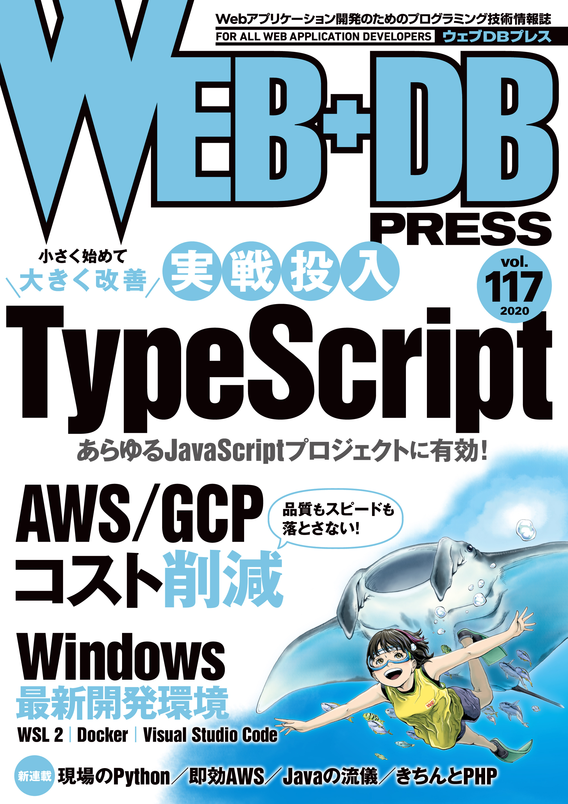
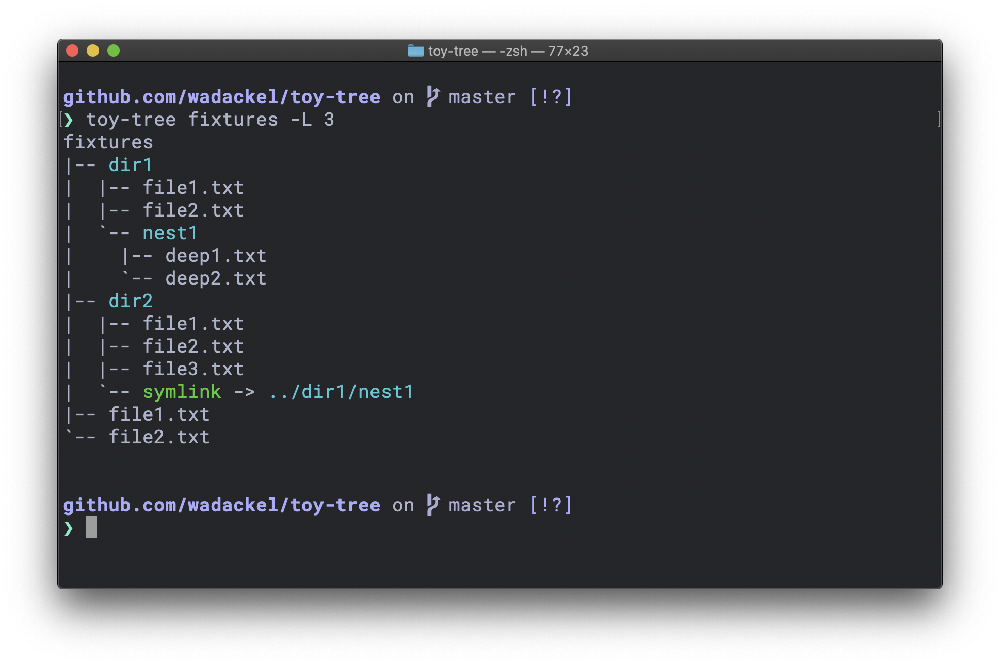

# toy-tree

2020 年 6 月 24 日発売の [WEB+DB PRESS Vol.117](https://gihyo.jp/magazine/wdpress/archive/2020/vol117) 「特集 1 小さく始めて，大きく改善 実戦投入 TypeScript」のサンプルリポジトリです。

特集内で扱う `tree` コマンドの再実装を行っています。コミット単位で作業が別れているため、特集を読み進めるにあたって参考にしてください。



## Screenshots



実装がすべて完了した状態の出力例です。

## Requirements

- [Node.js](https://nodejs.org) - 12.x 以上をお使いください

## Getting Started

本リポジトリに含まれるソースコードを動作させるための手順について記載します。

### Setup

ソースコードの準備と依存するパッケージのインストールです。

```bash
$ git clone https://github.com/wadackel/toy-tree.git
$ cd toy-tree
$ npm install
```

### Build & Installation

ソースコードのビルドと、コマンドとして使用するためのグローバルインストールを行います。

```bash
$ npm run build
$ npm install --global
```

これで `toy-tree` コマンドが使えるようになります。

## License

[MIT License © wadackel](./LICENSE)
